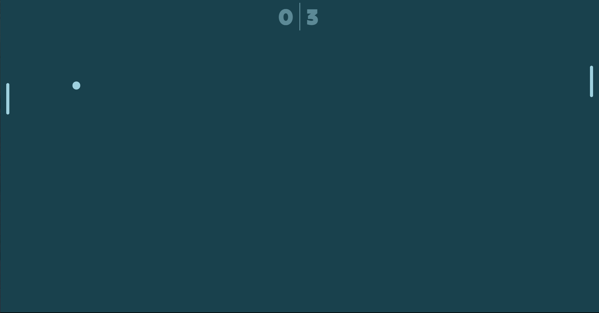

### Screenshot




### [URL LINK](https://pongbilska.netlify.app/)


### Built with

- HTML5
- CSS
- JavaScript


### What I learned

- [CSS hsl colour tutorial and why to use it](https://www.youtube.com/watch?v=EJtmfkKulNA)
- [UNIT VECTOR](https://www.youtube.com/watch?v=EJtmfkKulNA)
- [Math.abs()](https://www.youtube.com/watch?v=xR82Jx4pqIc)


- hsl colour:
```css
:root {
    --hue: 10;
    --saturation: 50%;
    --foreground-color:hsl(var(--hue), var(--saturation), 75%);
    --background-color:hsl(var(--hue), var(--saturation), 20%);
}
```
```js
const proudOfThisFunc = () => {
  console.log('🎉')
}
```
## Author

- Based on [this cool tutorial](https://www.youtube.com/watch?v=PeY6lXPrPaA)
